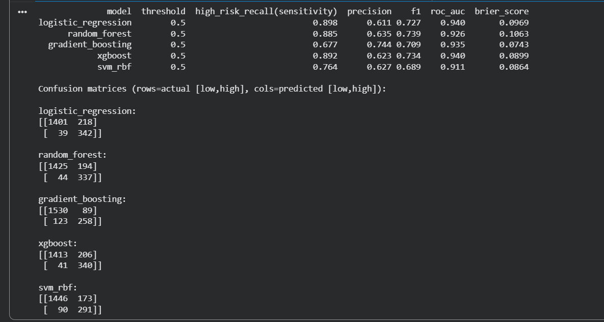
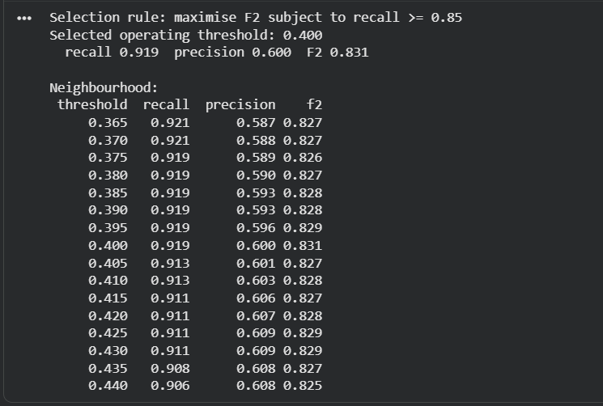
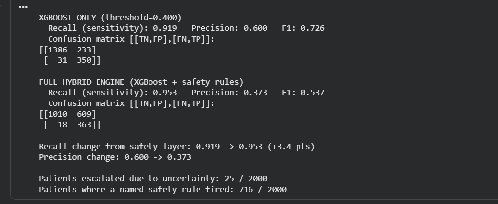

# PatientTriage.ai

### AI-assisted emergency department triage, Dynamic queue intelligence, and surge simulation — keeping clinicians in control.

**Developed for:** Accenture Innovation Challenge 2026 — Round 2  
**Problem Track:** PatientTriage.ai  
**Team:** error_404

## Authors

| Name | Role | LinkedIn | Github | Website |
|------|------|----------|--------|---------|
| **Ritam Mondal** | Team Leader | [Linkedin](https://www.linkedin.com/in/ritam-mondal-86a369287/) | [Github](https://github.com/ritammondal2004) | [Portfolio](https://ritammondal.vercel.app/) |
| **Ushasee Roy** | Team Member |  [Linkedin](https://www.linkedin.com/in/ushasee-roy-5a9a82273/) | [Github](https://github.com/Ushasee04) | |
| **Nilambar Mondal** | Team Member |  [Linkedin]() | [Github](https://github.com/NILAMBARMANDAL) | | 

---

---

## 🚀 Live Demo

### Frontend
**[PatientTriage.ai Command Center](https://safetriage.vercel.app/)**

### Backend API (swagger)
**[PatientTriage.ai API](http://patienttriage-alb-19208886.eu-north-1.elb.amazonaws.com/docs)**

### Backend API Architecture
**Vercel → Cloudflare Worker → AWS ALB → ECS/Fargate → PostgreSQL (Neon)**

---

# 🧰 Tech Stack

| Category | Technologies |
|----------|--------------|
| **Programming Language** |  |
| **Backend** |  |
| **Frontend** |    |
| **Frontend State / API** |  |
| **Machine Learning** |  |
| **Database** |   |
| **ORM / Validation** | SQLAlchemy + Pydantic |
| **Simulation** |  |
| **Containerization** |  |
| **Cloud Backend** |  |
| **Frontend Hosting** |  |
| **HTTPS / Edge Proxy** |  |
| **Testing** |  |
| **Version Control** |   |

---


## 🧠 Project Overview

Emergency Departments operate under intense time pressure. Patients may arrive with incomplete medical information, ambiguous symptoms, missing vital signs, and very different levels of urgency. At the same time, the waiting queue and available resources continuously change.

**PatientTriage.ai** is an AI-assisted Emergency Department command-center prototype designed to support clinicians during this process.

The system combines:

- Machine-learning based risk scoring
- Deterministic safety rules
- Explicit confidence / uncertainty signals
- Dynamic queue prioritization
- Waiting-patient reassessment logic
- Clinician override workflows
- Audit logging
- ED surge simulation

The goal is not to replace clinical judgement. The system provides an additional decision-support layer while keeping the **clinician as the final decision-maker**.

> **Prototype Notice:** PatientTriage.ai is a research/demo prototype using synthetic and simulated data. It is not validated or approved for clinical use.

---

# 🎯 Problem Statement

Emergency triage decisions must often be made within seconds using incomplete and inconsistent information.

Key challenges include:

- **Incomplete information:** first-time patients may have little or no prior history available.
- **Ambiguous presentations:** symptoms can overlap across different severity levels.
- **Different patient populations:** pediatric, adult, and geriatric patients can require different safety considerations.
- **Asymmetric risk:** missing a critical patient is more dangerous than unnecessarily escalating a lower-risk patient.
- **Dynamic waiting conditions:** patient risk can change while they remain in the queue.
- **Operational pressure:** sudden increases in patient volume can overwhelm available capacity.
- **Clinical accountability:** recommendations must remain reviewable and overridable by clinicians.

These challenges are explicitly highlighted in the Round 2 PatientTriage.ai problem statement. :contentReference[oaicite:3]{index=3}

---

# 💡 Our Solution

PatientTriage.ai uses a **hybrid decision-support architecture** rather than relying on machine learning alone.

```text
Patient Intake
      ↓
Feature Engineering
      ↓
ML Risk Engine
      ↓
Safety + Uncertainty Layer
      ↓
Priority + Confidence
      ↓
Live ED Queue
      ↓
Reassessment / Monitoring
      ↓
Clinician Review / Override
      ↓
Audit Trail

                    ↘
                 ED Simulation


################


## Patient_Triage.AI
### Our repo structure


```
```
PatientTriage.ai/
│
├── app/                              # FastAPI layer only: HTTP + orchestration
│   ├── __init__.py
│   ├── main.py
│   ├── api/
│   │   ├── __init__.py
│   │   ├── deps.py                   # DB session + auth dependencies
│   │   ├── routes_patients.py
│   │   ├── routes_triage.py
│   │   ├── routes_queue.py
│   │   ├── routes_overrides.py
│   │   ├── routes_simulation.py      # trigger normal / 3x surge runs
│   │   └── routes_audit.py           # DPDP audit trail read-back
│   ├── core/
│   │   ├── __init__.py
│   │   ├── config.py                 # pydantic-settings, reads .env
│   │   ├── database.py               # engine, SessionLocal, get_db
│   │   └── security.py               # API key, PII redaction helpers
│   ├── models/
│   │   ├── __init__.py
│   │   ├── orm.py                    # SQLAlchemy — authoritative schema
│   │   └── schemas.py                # Pydantic request/response
│   └── services/
│       ├── __init__.py
│       ├── triage_service.py
│       ├── queue_service.py
│       ├── reassessment_service.py   # live wait-time / worsening-vitals monitor
│       ├── simulation_service.py
│       └── audit_service.py
│
├── risk_engine/                      # zero framework deps: no FastAPI, no SimPy
│   ├── __init__.py
│   ├── config.py
│   ├── feature_engineering.py
│   ├── safety_rules.py
│   ├── uncertainty.py
│   ├── reassessment.py               # pure policy: is this patient due for re-triage?
│   ├── predictor.py
│   └── artifacts/
│       ├── pipeline_xgboost.joblib
│       ├── engine_config.json
│       ├── model_card.json      
│       └── challengers/
│           ├── logistic_regression.joblib
│           ├── random_forest.joblib
│           ├── gradient_boosting.joblib
│           └── svm_rbf.joblib
│
├── synthetic/                        # shared synthetic patient source
│   ├── __init__.py
│   └── generator.py   
│
├── simulation/                       # may import risk_engine + synthetic, never app
│   ├── __init__.py
│   ├── arrivals.py
│   ├── resources.py
│   ├── queue.py
│   ├── ed_simulation.py
│   └── scenarios.py                  # normal vs 3x surge configurations
│
├── database/
│   ├── __init__.py
│   ├── seed_data.py
│   ├── schema.sql                    # generated, not hand-edited
│   └── README.md
│
├── frontend/                         # built separately — placeholder + API contract only
│   └── README.md
│
├── tests/
│   ├── __init__.py
│   ├── conftest.py
│   ├── test_risk_engine.py
│   ├── test_synthetic.py
│   ├── test_api.py
│   └── test_simulation.py
│    
├── scripts/
│   ├── export_schema.py              # ORM -> database/schema.sql
│   ├── run_simulation.py             # CLI: normal + surge, prints the comparison table
│   └── demo_showcase.py              # the PS edge-case walkthrough, ~20 records
│
├── notebooks/
│   └── PatientTriage_ai_Risk_Engine1.ipynb
│
├── docs/
│   └── architecture.md 
│
├── Dockerfile
├── docker-compose.yml
├── requirements.txt
├── .env
├── .gitignore         
├── README.md
└── .github/
    └── workflows/
        └── ci-cd.yml
```

# ⚙️ Local Installation
1. Clone the repository

```
git clone https://github.com/ritammondal2004/Patient-Triage-ai.git
cd Patient-Triage-ai 
```
---
2. Backend Setup

 - Create a Python virtual environment:

Windows
```
python -m venv .venv
.venv\Scripts\activate
```
Linux / macOS
```
python3 -m venv .venv
source .venv/bin/activate
```

Install dependencies:
```
pip install -r requirements.txt
```

Create a .env file in the project root.

Example:

```
DATABASE_URL=<your-postgresql-or-local-database-url>

ENVIRONMENT=development

DEBUG=true

CORS_ORIGINS=http://localhost:5173
```

Do not commit real credentials or secrets.

3. Start the Backend
```
uvicorn app.main:app --reload --port 8000
```

Backend:
```
http://localhost:8000
```

Swagger:
```
http://localhost:8000/docs
```
---

4. Frontend Setup

Open a second terminal:
```
cd frontend
npm install
```

Create:
```
frontend/.env
```
For local development:
```
VITE_API_URL=http://localhost:8000
```

Start the frontend:
```
npm run dev
```
Frontend:
```
http://localhost:5173
```


# 🚀 Production Deployment — AWS ECS

## Project
PatientTriage.ai API

```
## AWS
- Region: `eu-north-1`
- ECS Cluster: `patienttriage-prod`
- ECS Service: `patienttriage-api-service-v7gmlenl`
- ECR Repository: `patienttriage-api`
```
```
## Deploy after backend/Dockerfile changes

```powershell
cd "PatientTriageAI\"

# Get ECR URI
$ECR_URI = aws ecr describe-repositories `
  --repository-names patienttriage-api `
  --region eu-north-1 `
  --query "repositories[0].repositoryUri" `
  --output text

```

### Login
```
aws ecr get-login-password --region eu-north-1 |
  docker login --username AWS --password-stdin $ECR_URI
```

### Build
```
docker build -t patienttriage-api .
```

### Tag
```
docker tag patienttriage-api:latest "$ECR_URI:latest"
```

### Push
```
docker push "$ECR_URI:latest" 
```

### Deploy new image
```
aws ecs update-service `
  --cluster patienttriage-prod `
  --service patienttriage-api-service-v7gmlenl `
  --force-new-deployment `
  --region eu-north-1 

```

---

# 🔌 API Overview
### Triage
```
GET  /triage/engine
POST /triage/intake
GET  /triage/visits/{visit_id}
POST /triage/visits/{visit_id}/vitals
POST /triage/visits/{visit_id}/rescore
GET  /triage/visits/{visit_id}/reassessment
```
### Queue
```
GET  /queue
GET  /queue/summary
POST /queue/next
POST /queue/visits/{visit_id}/close
POST /queue/reassess
```
### Patients
```
GET /patients
GET /patients/{patient_id}
Overrides
GET  /overrides
POST /overrides/{assessment_id}
GET  /overrides/{override_id} 
```

### Simulation
```
GET  /simulation/scenarios
POST /simulation/run
GET  /simulation/daynight
POST /simulation/ablation
```
### Audit
```
GET /audit/events
GET /audit/verify
GET /audit/policy
```

----

### Core Principle

**AI for speed → Safety rules for fail-safe behaviour → Clinician for final authority**

The ML model provides a risk estimate, while deterministic safety logic and uncertainty signals help prevent the system from treating a statistical prediction as unquestionable clinical truth.

---

✨ Key Capabilities
==================

| Capability | What it does |
| --- | --- |
| **Patient Intake** | Captures demographics, presentation, symptoms, arrival mode and available vitals |
| **AI Triage** | Generates a 5-level priority recommendation using the risk engine |
| **Confidence / Uncertainty** | Makes uncertainty visible when information is incomplete or ambiguous |
| **Safety Rules** | Applies deterministic escalation logic for safety-critical conditions |
| **Live Queue** | Organizes waiting patients by urgency and waiting conditions |
| **Reassessment** | Identifies patients who may require reassessment while waiting |
| **Clinician Override** | Allows clinicians to change an AI recommendation with a recorded reason |
| **Audit Trail** | Records important system and clinician decisions for traceability |
| **ED Simulation** | Simulates emergency-department flow over configurable periods |
| **Surge Analysis** | Tests normal, busy and mass-casualty operating conditions |
| **Day/Night Analysis** | Compares operational behaviour across different time periods |

---

🔄 End-to-End Workflow
======================

### 1. Patient Arrival

A patient arrives through walk-in, ambulance or referral.

### 2. Intake

Staff enters the information available at the time of triage.

### 3. Risk Assessment

The ML risk engine evaluates the structured patient information.

### 4. Safety & Uncertainty Layer

Deterministic rules and uncertainty checks evaluate whether the recommendation requires additional attention or escalation.

### 5. Recommendation

The system returns:

* Priority level
* Risk probability
* Confidence indicator
* Supporting safety/uncertainty information

### 6. Queue

The patient enters the operational waiting queue.

### 7. Reassessment

Patients can be flagged when their waiting conditions or reassessment thresholds indicate that the original recommendation should be revisited.

### 8. Clinician Review

A clinician can accept the recommendation or override it.

### 9. Audit

The assessment and any clinician override are recorded for traceability.

### 10. Operational Simulation

Hospital operations teams can simulate higher demand and staffing conditions without affecting a live ED.

-----


# 🖥️ Command Center Modules
Dashboard

Provides a high-level view of:

- Current waiting patients
- Priority distribution
- Waiting-time metrics
- Reassessment indicators
- AI engine status

## Patient Intake

Captures the information available during the initial ED assessment and sends it to the triage engine.

## Queue

Provides the live operational waiting list and supports queue actions such as calling the next patient and closing visits.

## Patients

Provides a historical view of patients, visits and assessment information.

## Overrides

Allows clinicians to override AI recommendations while capturing the clinician, priority change and reason.

## Simulation

Runs ED operational simulations and compares scenarios such as normal demand, busy shifts and mass-casualty surges.

## Audit Trail

Provides visibility into recorded assessments, overrides and audit events.

----

# AI / Risk Engine

The prototype uses a hybrid risk-assessment approach.

1. Feature Engineering

Structured patient information is transformed into model-ready features.

2. ML Prediction

The production prototype uses an XGBoost-based risk model to estimate patient risk.

3. Safety Rules

Deterministic rules provide an additional safety layer for conditions where simple statistical prediction should not be the sole decision mechanism.

4. Uncertainty / Confidence

The system explicitly communicates the confidence of its recommendation, particularly when information is incomplete or ambiguous.

5. Final Recommendation

The resulting assessment combines risk estimation with safety and uncertainty information before presenting the recommendation to the clinician.

The prototype model is trained and evaluated using synthetic data and is not clinically validated.


----

# 📊 Model Development & Evaluation 





### Candidate model comparison: Five ML approaches were evaluated with high-risk recall as the primary triage metric
----



```
Selection rule: maximise F2 subject to recall >= 0.85
Selected operating threshold: 0.400
recall 0.919
precision 0.600
F2 0.831
```
### Safety-oriented operating threshold: XGBoost uses a 0.400 operating threshold selected to maximize F2 while maintaining at least 85% recall.

----

The PatientTriage.ai risk engine was developed using a synthetic Emergency Department dataset designed to represent realistic intake conditions, including vital signs, age group, presenting complaint, symptom severity, history availability and arrival mode.

The modelling pipeline evaluates multiple candidate classifiers before selecting a production prototype model.

### Candidate Models

| Model | Role |
|------|------|
| Logistic Regression | Interpretable baseline |
| Random Forest | Non-linear tree ensemble |
| Gradient Boosting | Boosted tree baseline |
| **XGBoost** | **Selected production prototype** |
| RBF SVM | Non-linear comparison model |

### Evaluation Philosophy

For ED triage, a missed high-risk patient is more concerning than unnecessarily escalating a lower-risk patient.

Therefore, model selection prioritizes:

**High-risk recall → F2 score → precision / calibration**

rather than optimizing accuracy alone.

At the selected operating threshold of **0.400**, the XGBoost prototype achieved:

| Metric | XGBoost |
|--------|---------|
| High-risk Recall | **91.9%** |
| Precision | **60.0%** |
| F2 Score | **83.1%** |

The threshold was selected by maximizing **F2 score subject to a minimum recall requirement of 85%**.

---

# 🛡️ Hybrid Safety Layer 




Safety-layer impact: Adding deterministic safety rules increased synthetic high-risk recall from 91.9% to 95.3%, trading precision for more conservative escalation

----

The final system does not rely solely on the ML prediction.

The XGBoost recommendation is passed through additional deterministic safety logic designed to identify predefined red-flag conditions.

### Why?

A purely statistical model may miss rare but safety-critical combinations of symptoms and vitals.

The hybrid architecture therefore combines:

```text
XGBoost Risk Prediction
          +
Deterministic Safety Rules
          +
Model Uncertainty
          ↓
Final Triage Recommendation
```

----


  

## CI/CD Pipeline

The project utilizes GitHub Actions for continuous integration and deployment.

- **Continuous Integration (CI):** Runs on all Pull Requests and pushes to \main\. It automatically validates the Python backend using pytest, checks the frontend TypeScript/Vite build, and attempts a dry-run Docker build to prevent broken code from being merged.
- **Continuous Deployment (CD):** Merges to \main\ that pass CI automatically trigger the CD workflow.
- **Backend Deployment:** GitHub Actions securely authenticates to AWS using OIDC (OpenID Connect), bypassing the need for hard-coded AWS credentials. The latest Docker image is pushed to ECR and a new ECS/Fargate deployment is forced.
- **Frontend Deployment:** Vercel automatically deploys the frontend upon a successful \main\ push via its native Git integration.

